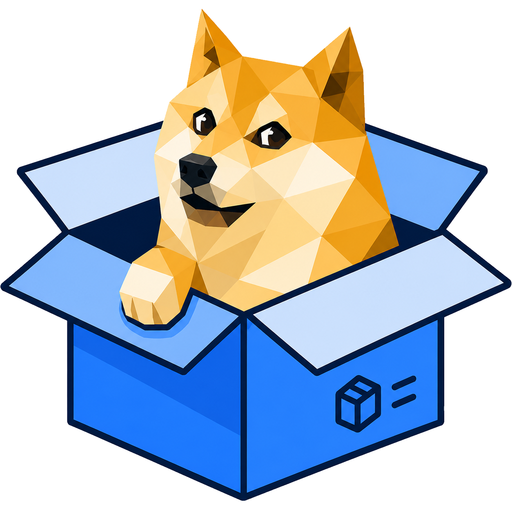

# ShibeShip Offline PIN Unlock

<p align="center">
  
</p>

<p align="center">
  <strong>Recover Dogecoin escrow wallets without the marketplace online.</strong><br>
  Runs entirely in your browser — no server, no custody, no account required.
</p>

<p align="center">
  <a href="https://shibeship.com/">ShibeShip Marketplace</a> ·
  <a href="https://github.com/qlpqlp/Shibeship">Main project on GitHub</a> ·
  <a href="https://dogecoin.com">Dogecoin</a>
</p>

---

## What is this?

**ShibeShip Offline PIN Unlock** (`index.html`) is a standalone web page that decrypts order escrow wallets using the same cryptography as [ShibeShip](https://shibeship.com/) — the open-source Dogecoin community marketplace.

Use it when:

- ShibeShip is temporarily down or unreachable
- You want a **local, offline copy** of the unlock flow
- You need to recover funds using only what you saved from your order emails

Open `index.html` in any modern browser (Chrome, Firefox, Safari, Edge). After the page loads, you can disconnect from the internet; decryption happens on your device only.

---

## Split custody — a new approach to escrow

ShibeShip does **not** hold your Dogecoin. Funds for PIN-escrow orders sit in a **per-order wallet** on the Dogecoin blockchain. Access to that wallet is split between buyer and seller so **neither party can move the coins alone**.

| Party | Holds | Received via |
|-------|--------|----------------|
| **Seller** | Encrypted private key | ShibeShip order email (save it safely) |
| **Buyer** | 6-part PIN (5 Doge words + 8-char security code last) | Checkout / bid confirmation email (save it safely) |

Together, these two pieces unlock the wallet. ShibeShip never stores the decrypted private key and cannot spend the funds on its own.

This is **split custody**: security for both sides without a central custodian.

```
Buyer PIN  +  Seller encrypted key  →  Decrypted wallet  →  Sweep DOGE to your own address
     🔑              🔐                           ✅
```

Neither half is useful by itself. A seller with only the encrypted key cannot spend. A buyer with only the PIN cannot spend. **Both must cooperate** after the deal is done (or when a refund/recovery is agreed).

---

## What each party should do

### If you are the **seller**

1. When an order is paid, ShibeShip emails you an **encrypted private key** (a long string, usually starting with `v2:`).
2. **Save that key** — in your email, a password manager, or a secure offline copy.
3. Ship the item or complete the service as usual.
4. After delivery, **ask the buyer for their 6-word PIN** (in the same order they received it).
5. Unlock the wallet:
   - **On ShibeShip:** Seller dashboard → Orders → enter the buyer’s PIN, or
   - **Offline:** Use this tool — paste your encrypted key + the buyer’s PIN.
6. **Sweep all DOGE immediately** to a wallet you control ([Dogecoin Wallet](https://dogecoinwallet.org) or Dogecoin Core). Do not leave funds in the order wallet.

> **Important:** You cannot unlock funds without the buyer’s PIN. That protects the buyer until they are satisfied with delivery.

### If you are the **buyer**

1. At checkout (or when paying a bid fee), ShibeShip shows and emails you a **6-word PIN** — six words from the Dogecoin-themed word list, e.g. `69 MOON DOGE HAPPY PAW KEYS`.
2. **Write it down and store it safely.** Treat it like a password. You need the exact words in the correct order.
3. You may also receive an **encrypted private key** in your email as a **backup copy** for offline recovery. Keep that too if provided.
4. If you need to recover funds and ShibeShip is offline:
   - Use your **6-word PIN** plus the **encrypted private key**
   - If you only have the PIN, **ask the seller** for the encrypted key they received (they were emailed the same escrow material for that order)
5. For auction bid-fee refunds (when you did not win), ShibeShip may send a **private refund link** — you can also use this offline tool if you have both the PIN and encrypted key from your emails.

> **Important:** Never share your PIN publicly. Only give it to the seller **after** you have received what you paid for (or as part of an agreed refund).

---

## How to use this tool

Follow the four steps in the app:

### 1. How it works

Read the split-custody summary: seller key + buyer PIN.

### 2. Paste encrypted key

Paste the **encrypted private key** from your ShibeShip email:

- Modern orders: string starting with `v2:` (e.g. `v2:a1b2c3d4…:…`)
- Older orders: legacy format without `v2:` is still supported

**Sellers:** use the key from your seller order email.  
**Buyers:** use the backup key from your email, or ask the seller for theirs.

### 3. Enter 6-word PIN

Enter the **6-word PIN** from the buyer’s checkout or bid email:

- All six words, correct order
- Spaces between words are fine
- The meter shows how many words you have entered

### 4. Sweep

If the PIN and key match, the tool shows the **decrypted private key** (WIF format) and a **QR code** encoding that same key.

**Move funds immediately** — use either option below:

### Option A — Dogecoin Wallet (mobile)

1. Install [Dogecoin Wallet](https://dogecoinwallet.org)
2. Open **Settings → Sweep**
3. **Scan the QR code** on screen or paste the private key
4. Confirm sweep to **your own** Dogecoin address

### Option B — Dogecoin Core (desktop)

1. Install [Dogecoin Core](https://dogecoin.com/wallets/) on your computer
2. Go to **File → Import Private Key**
3. Paste the private key shown in the tool (or copy it from below the QR)
4. **Send all DOGE** to a wallet you control as soon as the import completes

Do not leave funds in the temporary order wallet.

---

## Security & privacy

| Property | Detail |
|----------|--------|
| **No custody** | ShibeShip does not hold decrypted keys or PINs on your behalf for offline recovery |
| **Client-side only** | Decryption uses the browser Web Crypto API; nothing is sent to ShibeShip or any API |
| **Offline capable** | Load the page once, then you can disconnect and still decrypt |
| **Open source** | Same encryption logic as the main [ShibeShip repository](https://github.com/qlpqlp/Shibeship) (`AES-128-CTR`, `v2:` salt format) |
| **Verify before trust** | You can audit `index.html` — it is a single self-contained file with no external scripts |

**Best practices:**

- Save encrypted keys and PINs in separate secure places
- Never post keys or PINs in chat, social media, or support tickets
- Sweep unlocked wallets right away; order wallets are temporary
- Only share your PIN with the seller when the transaction terms are met

---

## Files in this folder

| File | Purpose |
|------|---------|
| `index.html` | Offline PIN unlock tool (publish with `js/` and `img/`) |
| `js/shibeship-pin.js` | Shared PIN parse/decrypt helpers (new + legacy PIN formats) |
| `js/qr-code-styling.js` | Bundled QR library (works offline after page load) |
| `img/shibeship.png` | ShibeShip logo used by the tool UI and QR center icon |
| `README.md` | This documentation |

---

## Hosting on GitHub

You can publish this folder as its own repository or GitHub Pages site:

1. Upload `index.html`, `js/shibeship-pin.js`, `js/qr-code-styling.js`, `img/shibeship.png`, and this `README.md`
2. Enable **GitHub Pages** (Settings → Pages → deploy from `main` branch, root or `/docs`)
3. Your tool will be available at `https://<username>.github.io/<repo>/` (or the path where `index.html` lives)

Users can also download `index.html` and open it locally — double-click or **File → Open** in the browser.

---

## Related links

- **Marketplace:** [https://shibeship.com/](https://shibeship.com/)
- **Source code:** [https://github.com/qlpqlp/Shibeship](https://github.com/qlpqlp/Shibeship)
- **Dogecoin:** [https://dogecoin.com](https://dogecoin.com)
- **Dogecoin Wallet (sweep):** [https://dogecoinwallet.org](https://dogecoinwallet.org)
- **Live tool on ShibeShip:** [https://shibeship.com/tools/index.html](https://shibeship.com/tools/index.html)

---

## When *not* to use this tool

- **GigaWallet orders** — payment went directly to the seller’s address; there is no split PIN escrow wallet.
- **Wrong order** — PIN and encrypted key must be from the **same** order.
- **You only have one half** — find the missing piece (ask the other party or check your ShibeShip emails) before trying again.

---

<p align="center">
  <em>Do Only Good Everyday</em> — ShibeShip split-custody escrow for the Dogecoin community.
</p>
